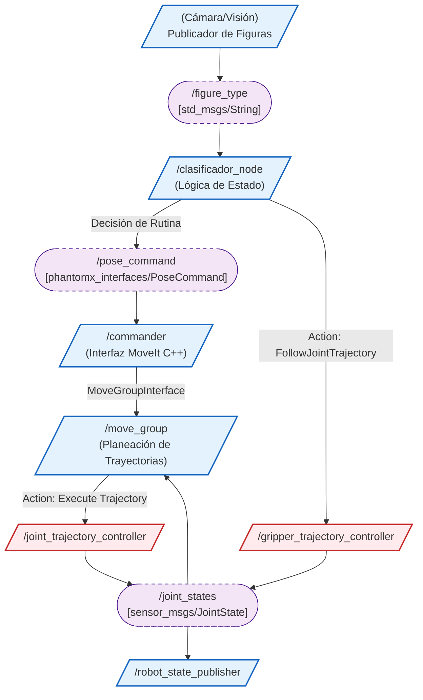
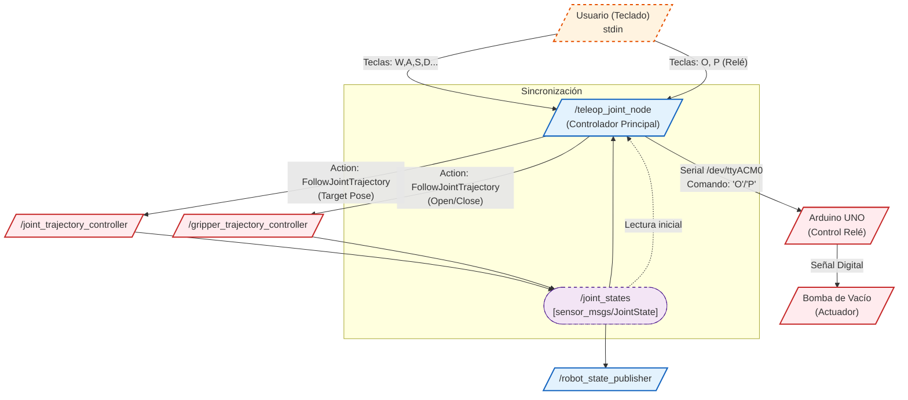

# Manipulación y Clasificación Robot PhantomX Pincher

## Integrantes

- Juan Manuel Beltran Botello 
- Oscar Jhondairo Siabato Leon
- Edgar Esteban Erazo Lagos
- Alejandro Mendivelso Torres


## Conceptos Técnicos Clave
Para entender y modificar este proyecto, es útil tener en cuenta los siguientes conceptos: 
- Máquina de Estados (State Machine)
El software que gestiona la secuencia de clasificación no opera como un simple script lineal (ejecuta A, luego B, luego C). En cambio, está estructurado como una Máquina de Estados (State Machine).

¿Por qué es crucial esta arquitectura? En robótica, las operaciones físicas no son instantáneas: un movimiento puede demorar 3 segundos, y la apertura de una pinza 1 segundo. El programa debe gestionar estas esperas sin bloquearse.

El corazón del sistema sabe con precisión en qué "Estado" se encuentra actualmente (por ejemplo: STATE_GRIPPING_CLOSING). Un temporizador interno verifica si el tiempo asignado a ese estado ha transcurrido. Una vez cumplido el plazo, el sistema transiciona automáticamente al siguiente "Estado" lógico de la secuencia (por ejemplo: STATE_LIFTING_CUBE). Este enfoque garantiza un control robusto, asíncrono y evita interrupciones o congelamientos del programa.
- **Cinemática Directa vs Inversa:**
Para mover el brazo, se utilizan dos enfoques fundamentales de cinemática:Cinemática Directa (Forward Kinematics): En el modo de teleoperación (Teleop), el usuario está aplicando conceptualmente cinemática directa. Se envían comandos para controlar directamente los ángulos de cada articulación ($q_1, q_2, q_3...$). El sistema calcula cuál es la posición final ($X, Y, Z$) resultante. Es un método intrínsecamente seguro ya que el comando es la posición del motor.Cinemática Inversa (Inverse Kinematics - IK): El clasificador automático utiliza IK. El comando es la posición deseada en el espacio de trabajo: "Mueve el efector final a $X=0.20$m, $Y=0.10$m". El algoritmo debe resolver internamente los ángulos ($q_i$) necesarios para alcanzar ese punto. Si la coordenada de destino está fuera del alcance físico (workspace) del robot, el sistema de IK detectará que no hay una solución válida, reportará un error e interrumpirá la tarea para prevenir daños.
- Comunicación ROS2
El proyecto implementa los dos principales mecanismos de comunicación inter-proceso de ROS 2:

- **Topics (Tópicos):** Son ideales para la transmisión de datos rápida, continua y unidireccional (modelo Publicar/Suscribir). Se utilizan, por ejemplo, cuando un sensor o un usuario externo publica el tipo de objeto detectado (/figure_type) al que el nodo clasificador está suscrito para iniciar su tarea.

- **Actions (Acciones):** Están diseñadas para manejar tareas de larga duración con la necesidad de feedback y cancelación (modelo Cliente/Servidor). Por ejemplo, cuando el nodo clasificador necesita que el robot se mueva, invoca una acción (típicamente FollowJointTrajectory). El cliente de acción le permite al clasificador esperar de manera controlada y no bloqueante hasta que el movimiento del brazo se haya completado exitosamente antes de proceder con el siguiente paso lógico de la Máquina de Estados.

## 1. Resumen del Proyecto
Este proyecto implementa un sistema avanzado de control y automatización para el brazo robótico PhantomX Pincher utilizando ROS2 (Robot Operating System 2). El sistema está diseñado para realizar tareas de manipulación de objetos ("pick and place") de manera robusta y precisa.

El desarrollo abarca dos modos principales de operación:

-**Teleoperación Manual:** Permite a un operador controlar cada articulación del robot, el efector final (gripper) y herramientas externas (bomba de vacío) utilizando el teclado del ordenador.

-**Clasificación Automática:** Un sistema autónomo que recibe un comando específico indicando el tipo de objeto ("cubo", "cilindro", "pentágono", "rectángulo") y ejecuta una coreografía de movimientos precisa para recoger el objeto y depositarlo en su contenedor específico.

## 2. Descripción General del Proyecto

Este proyecto implementa una solución de automatización para tareas de "pick and place" utilizando un brazo robótico PhantomX Pincher. El sistema utiliza ROS2 sobre Ubuntu 20.04/Linux para controlar el robot de manera precisa.

### Herramientas y Piezas Utilizadas

- **Robot:** PhantomX Pincher (4 Grados de Libertad + Gripper).
- **Software Principal:** ROS2 (Robot Operating System 2).
- **Lenguajes:**
  - Python (Lógica de control)
  - XML/Xacro (Descripción del robot)
  - YAML (Configuración)
  -  
### 2.1 Objetivo General

Implementar un sistema de control y automatización para el brazo robótico PhantomX Pincher usando ROS2.

### 2.2 Objetivos Específicos

Desarrollar un nodo de teleoperación articular.

Implementar un sistema automático de clasificación de objetos.

Integrar hardware externo (bomba de vacío).

Garantizar movimientos seguros y repetibles mediante estados y posiciones predefinidas.

### 2.3 Modos de Operación

- Teleoperación manual
- Clasificación automática

## Parte 1

## Objetivo
El objetivo es crear una rutina de robot que pueda recoger 4 objetos distintos que siempre se ubicarán en la zona de recolección y luego depositarlos en la caneca correspondiente según su tipo.

**Los objetos son:**
*   Un cubo
*   Un cilindro
*   Un pentágono
*   Un rectángulo
*   *Nota: Todos estos objetos tendrán la misma altura.*

**La clasificación de los objetos en las canecas será:**
*   El **cubo** debe dejarse en la **caneca roja**.
*   El **cilindro** debe dejarse en la **caneca verde**.
*   El **pentágono** debe dejarse en la **caneca azul**.
*   El **rectángulo** debe dejarse en la **caneca amarilla**.

## 1. Implementación en Código
La lógica se ha centralizado en el nodo `clasificador_node.py`. Se utiliza un diccionario para mapear cada figura entrante con su destino (caneca) correspondiente, cumpliendo estrictamente con los colores solicitados.

```python
# Extracto de clasificador_node.py
self.figure_to_bin = {
    'cubo': 'caneca_roja',            # Cubo -> Caneca Roja
    'cilindro': 'caneca_verde',       # Cilindro -> Caneca Verde
    'pentagono': 'caneca_azul',       # Pentágono -> Caneca Azul
    'rectangulo': 'caneca_amarilla'   # Rectángulo -> Caneca Amarilla
}
```

## 2. Lógica de Secuencia Completa
El robot no solo mueve el brazo, sino que ejecuta una **Máquina de Estados** para que la secuencia de movimiento + agarre sea robusta:

1.  **Recepción del comando:** El nodo escucha el tópico `/figure_type`.
2.  **Preparación:** Mueve el robot a `HOME` y abre el gripper.
3.  **Recolección:** Baja a la posición de recolección (`recoleccion`) definida en `poses.yaml`.
4.  **Agarre:** Cierra el gripper para sujetar la figura.
5.  **Transporte seguro:** Retorna a posiciones seguras (waypoints) o `HOME` antes de ir a la caneca para asegurar altura y evitar colisiones.
6.  **Deposición:** Llega a la coordenada de la caneca asignada (ej: `caneca_roja`) y abre el gripper.
7.  **Retorno:** Regresa a `HOME` siguiendo una ruta inversa segura.

## 3. Arquitectura ROS 2 y Cumplimiento Técnico

Para cumplir con el requerimiento de **"Implementación como nodo ROS 2 (listener + publisher) para ejecutar la rutina"**, la arquitectura se diseñó de la siguiente manera:

*   **Nodo Clasificador (`clasificador_node`):**
    *   Actúa como el cerebro de la operación.
    *   **Listener (Suscriptor):** Se suscribe al tópico `/figure_type` (tipo `std_msgs/msg/String`). Esto cumple con la parte de "recibir tipo de figura".
    *   **Publisher (Publicador):** Publica en el tópico `/pose_command`. Esto cumple con la parte de "publicar la secuencia de poses".

*   **Mensaje Personalizado (`PoseCommand`):**
    *   Se utiliza estrictamente el mensaje requerido `phantomx_pincher_interfaces/msg/PoseCommand`.
    *   Este mensaje encapsula la posición deseada (`x, y, z`) y la orientación (`roll, pitch, yaw`), junto con un booleano para indicar si se requiere `cartesian_path`.

*   **Gestión de Posición de Canecas:**
    *   El requerimiento menciona "reciba... posición de canecas".
    *   En lugar de hardcodear estas posiciones en el código Python, se utiliza el parámetro de configuración `poses.yaml`.
    *   El nodo carga dinámicamente las coordenadas de `caneca_roja`, `caneca_verde`, `caneca_azul`, y `caneca_amarilla` al iniciarse. Esto permite ajustar la ubicación física de las canecas sin modificar el código fuente, cumpliendo con la flexibilidad solicitada.

## 4. Actualización del Modelo Xacro (Soporte de Cámara y Canastillas)

**Cumplimiento en el Código:**
Se ha verificado el archivo `phantom_ws/src/phantomx_pincher_description/urdf/kit.xacro` y cumple totalmente con los requisitos de modelado:

*   **Soporte de Cámara (`camera_mast_link`):**
    *   **Visual:** Se define como un cilindro de metal (`<cylinder radius="0.01" length="0.5" />`) que representa el mástil, e incluye un bloque negro adicional (`<box>`) para simular la cámara.
    *   **Colisión:** Incluye la geometría de colisión correspondiente al cilindro del mástil.
    *   **Ubicación:** Posicionado detrás del robot (`xyz="-0.15 0 0.0"`), tal como se suele requerir para no obstruir el área de trabajo.

*   **Canastillas (Canecas):**
    *   Se han implementado 4 links independientes para las canecas:
        1.  `canecaLateralIzquierda_link` (Roja)
        2.  `canecaLateralDerecha_link` (Amarilla)
        3.  `canecaFrontalDerecha_link` (Verde)
        4.  `canecaFrontalIzquierda_link` (Azul)
    *   **Visual + Colisión:** Cada link utiliza el mesh STL `canecaGrande.stl` tanto para la etiqueta `<visual>` como para `<collision>`, asegurando que el planificador de movimientos (MoveIt) detecte estos objetos como obstáculos y evite chocarlos.

    
<p align="center">

<p>


## 5. Comandos de Operación

Para que el robot reaccione a los comandos, primero debes iniciar Rviz y luego el nodo clasificador con los siguientes comandos:

**1. Activar Rviz (Simulación o Real):**
Use `use_real_robot:=True` para conectar con el Phantom X Pincher real, o `False` para simulación.
```bash
ros2 launch phantomx_pincher_bringup phantomx_pincher.launch.py use_real_robot:=True
```

**2. Activar el modo de clasificación automático:**
```bash
ros2 run phantomx_pincher_classification clasificador_node
```

**3. Enviar Comandos de Clasificación:**
Para verificar el funcionamiento de cada rutina sin necesidad de la cámara, se deben ejecutar los siguientes comandos en una terminal con el entorno ROS2 cargado:

*   **Clasificar CUBO (Caneca Roja):**
    ```bash
    ros2 topic pub /figure_type std_msgs/msg/String "data: 'cubo'" --once
    ```

*   **Clasificar CILINDRO (Caneca Verde):**
    ```bash
    ros2 topic pub /figure_type std_msgs/msg/String "data: 'cilindro'" --once
    ```

*   **Clasificar PENTÁGONO (Caneca Azul):**
    ```bash
    ros2 topic pub /figure_type std_msgs/msg/String "data: 'pentagono'" --once
    ```

*   **Clasificar RECTÁNGULO (Caneca Amarilla):**
    ```bash
    ros2 topic pub /figure_type std_msgs/msg/String "data: 'rectangulo'" --once
    ```


### Diagrama de flujo parte 1



### Diagrama de Flujo Lógico - Parte 1 (Clasificador)

Lógica interna de la máquina de estados del clasificador.


### Video Simulacion y implentación

https://youtu.be/ROK0nHgKcZk

## Parte 2

## Objetivo
El objetivo principal es dotar al robot de una interfaz de control manual directa y robusta para:
*   **Control Articular Independiente:** Operar cada articulación paso a paso mediante el teclado para validación y posicionamiento preciso.
*   **Manejo de Herramientas:** Integrar el accionamiento del Gripper y la **Bomba de Vacío** (sistema neumático) en la misma interfaz.
*   **Seguridad y Pruebas:** Proveer funciones de "Home" y límites de seguridad para verificar el estado del hardware sin riesgos.

## 1. Añadir la Ventosa al Xacro

**Cumplimiento en el Código:**
Se encuentra implementado en el archivo `phantom_ws/src/phantomx_pincher_description/urdf/kit.xacro`.

*   **Link Implementado:** `airpump_link`
*   **Geometría:** Utiliza el mesh `ensambleAirpump.stl` para la representación visual de alta fidelidad.
*   **Colisiones:** Define una caja (`box`) que envuelve la estructura de la bomba para cálculos físicos eficientes (`<box size="0.062 0.0405 0.067" />`).
*   **Integración:** Conectada mediante el joint fijo `base_airpump_joint` a la base del robot (`baseFija_link`), reflejando su montaje real en la estación.
  
<p align="center">
  
<p>

## 2. Control por Teclado 

**Solución Implementada:**
Para cumplir con este requerimiento, se desarrolló el nodo `teleop_joint_node` en ROS 2 (Python). A diferencia de los teleoperadores genéricos que envían velocidades (`cmd_vel`), este nodo implementa un **Control Articular Posicional**.

*   **Funcionalidades Clave:**
    *   **Control Articular Independiente:** Permite mover cada joint (Base, Hombro, Codo, Muñeca) individualmente. Esto demuestra un control más fino que la cinemática inversa automática.
    *   **Posiciones Predefinidas:** Comandos rápidos para ir a `Home` (Espacio) y `Home Vertical` (H).

*   **Asignación de Teclas:**

| Tecla | Función / Articulación | Descripción de Acción |
| :--- | :--- | :--- |
| **W / S** | Hombro (Joint 2) | Mueve el brazo principal hacia arriba (W) o abajo (S). |
| **A / D** | Base (Joint 1) | Gira la base del robot hacia la izquierda (A) o derecha (D). |
| **Q / E** | Codo (Joint 3) | Flexiona (Q) o extiende (E) el codo del robot. |
| **Z / X** | Muñeca (Joint 4) | Mueve la muñeca hacia arriba (Z) o abajo (X). |

## 3. Activar la Ventosa mediante Teclado

**Solución Implementada:**
Dado que el controlador del robot no gestiona directamente relés de potencia de alto voltaje, se implementó una arquitectura híbrida **ROS-Microcontrolador**:

*   **Integración de Hardware:** Se utiliza una placa **Arduino** como interfaz de potencia. Esta placa controla un relé que abre o cierra el circuito de alimentación (12V) de la bomba de vacío.
*   **Protocolo de Comunicación:** El nodo `teleop_joint_node` establece una conexión serial asíncrona (a 9600 baudios) con el microcontrolador a través del puerto `/dev/ttyACM0`.

*   **Lógica de Activación:**
    *   **Tecla `O` (ON):** El nodo envía el comando de activación `'O'` al Arduino -> Arduino energiza relé -> Bomba succiona.
    *   **Tecla `P` (OFF):** El nodo envía el comando `'P'` -> Arduino corta energía -> Objeto liberado.

| Tecla | Función | Descripción |
| :--- | :--- | :--- |
| **O** | Ventosa ON | Envía señal al relé para activar la bomba (succión). |
| **P** | Ventosa OFF | Envía señal al relé para desactivar la bomba (soltar). |
| **R / F** | Gripper | Abre (R) o cierra (F) la pinza mecánica estándar. |

## 4. Comandos de Operación (Parte 2)

El orden de encendido es crítico para evitar conflictos de drivers.

**Paso A: Iniciar controladores del robot**
Primero, se debe levantar toda la infraestructura de ROS 2 (Drivers Dynamixel + MoveIt):
```bash
ros2 launch phantomx_pincher_bringup phantomx_pincher.launch.py use_real_robot:=True
```

**Paso B: Iniciar nodo de teleoperación**
En una nueva terminal (con el entorno sourcing activado), ejecuta el nodo de teclado:
```bash
ros2 run phantomx_pincher_classification teleop_joint_node
```

## Circuito utilizado para controlar la bomba

### Diagrama de conexiones


# Paquetes Creados y Propósito

A continuación se detallan los paquetes ROS 2 desarrollados y utilizados para cumplir con las Partes 1 y 2, incluyendo sus nodos principales y comandos de ejecución.

## 1. phantomx_pincher_classification
**Propósito:** Paquete principal que contiene la "inteligencia" y la lógica de aplicación del robot. Alberga los nodos de alto nivel que orquestan las rutinas automáticas y el control manual.

*   **Nodos Principales:**
    *   `clasificador_node.py` (Parte 1): Maquina de estados para clasificación de figuras (Cubo, Cilindro, etc.). Suscribe a `/figure_type` y publica en `/pose_command`.
    *   `teleop_joint_node.py` (Parte 2): Nodo de control manual por teclado. Gestiona movimiento articular directo y comunicación con Arduino para la ventosa.
*   **Cómo ejecutarlo:**
    *   Parte 1: `ros2 run phantomx_pincher_classification clasificador_node`
    *   Parte 2: `ros2 run phantomx_pincher_classification teleop_joint_node`

## 2. phantomx_pincher_description
**Propósito:** Contiene la descripción física y visual del robot. Es fundamental para la simulación en RViz y para que MoveIt sepa planificar trayectorias sin chocar.

*   **Archivos Clave (URDF/Xacro):**
    *   `phantomx_pincher_arm.xacro`: Define la cinemática del brazo y sus articulaciones.
    *   `kit.xacro`: Define el entorno de trabajo (**Canecas, Mástil de Cámara, Ventosa**). Aquí se integraron los nuevos elementos requeridos por la rúbrica.
*   **Ejecución:** Se carga automáticamente al iniciar `phantomx_pincher_bringup`.

## 3. phantomx_pincher_bringup
**Propósito:** Paquete de orquestación (Launch files) y configuración. Facilita el inicio de todo el sistema con un solo comando.

*   **Elementos Clave:**
    *   `launch/phantomx_pincher.launch.py`: Launch file maestro que inicia: `robot_state_publisher`, `rviz`, controladores de hardware y MoveIt.
    *   `config/poses.yaml`: Archivo de configuración donde se definen las coordenadas (X, Y, Z, RPY) de todas las **canecas**, posiciones de recolección y puntos seguros.
*   **Cómo ejecutarlos:**
    *   Simulación: `ros2 launch phantomx_pincher_bringup phantomx_pincher.launch.py use_real_robot:=False`
    *   Real: `ros2 launch phantomx_pincher_bringup phantomx_pincher.launch.py use_real_robot:=True`

## 4. phantomx_pincher_interfaces
**Propósito:** Define estructuras de mensajes personalizados para facilitar la comunicación modular entre nodos.

*   **Mensajes:**
    *   `PoseCommand.msg`: Mensaje personalizado utilizado en la Parte 1. Estructura: `float64 x, y, z, roll, pitch, yaw` y `bool cartesian_path`.
*   **Uso:** Utilizado por `clasificador_node` para enviar órdenes de movimiento abstractas.

## 5. phantomx_pincher_moveit_config
**Propósito:** Configuración generada para el framework de planeación de movimiento MoveIt 2.

*   **contenido:**
    *   SRDF (Semantic Robot Description Format): Define grupos de planeación (`arm`, `gripper`) y posturas predefinidas.
    *   Configuración de controladores (`ros2_controllers.yaml`).
*   **Uso:** Es invocado internamente por el `bringup` para habilitar la planificación de trayectorias y evitación de colisiones.
*   

### Diagrama de flujo parte 2 (Ventosa)


### Diagrama de Flujo Lógico - Parte 2 (Teleoperación)

Lógica de control de hardware directo.


## Plano de planta


## Video

https://youtu.be/e51e9fDQWuY
